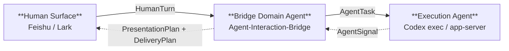
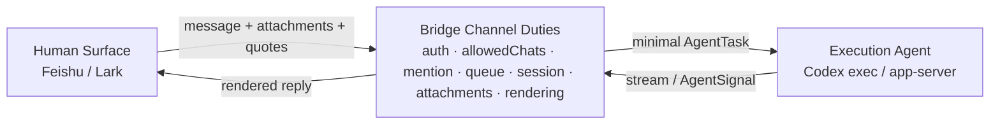
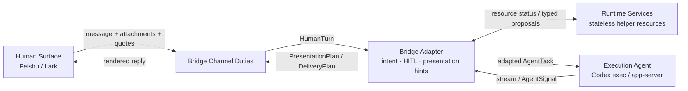

# Agent-Interaction-Bridge

`Agent-Interaction-Bridge` is a local-first bounded interaction product. It
mediates between human surfaces and execution agents by keeping meaning,
capability, state, presentation, delivery, and execution authority as separate
runtime objects.

The current product path connects Feishu/Lark to a local Codex execution
endpoint. Future surfaces can use the same bridge boundary without inheriting
Feishu/Lark transport details or Codex-specific session semantics.

This `README.md` is the human-facing product narrative. [`PRD.md`](./PRD.md)
is the fixed equivalent formal L0 projection: it compresses the same product intent,
P0 scope, non-goals, downstream chain, and owner boundary before architecture
contracts, agent-devops indexes, runtime objects, CLI commands, carrier
adapters, or channel rendering code are changed.

Runtime path:



Runtime Services are the support plane for profiles, resources, sessions,
ActionLog, artifacts, vectors, and other runtime state stores.

Detailed object flows are split into layered diagrams in
[architecture/system-design.md](./architecture/system-design.md). Keep this
entry page to product positioning, operator setup, and the single runtime path.

The bridge domain agent is a trust boundary. Local Codex can run with broad
filesystem and shell access; remote or A2A execution endpoints need explicit
capability profiles, HITL policy, credential boundaries, state boundaries, and
audit logs.

## Gateway Modes

`preferences.gatewayMode` selects how much interpretation the bridge applies
between the channel and the execution agent:

- `adapter` keeps the bounded interaction-agent behavior.
  Bridge may classify intent, inject HITL/presentation protocol guidance,
  request stateless helper proposals from Runtime Services, choose reply-mode
  hints, and apply Feishu/Lark delivery support.
- `relay` is the channel relay path. Bridge still handles credentials,
  access control, mention policy, queueing, sessions, cwd/profile policy,
  explicitly required approvals, attachments, quotes, stream rendering, and
  channel delivery, but it does not run complex intent classification,
  Dynamic UI routing, presentation transforms, delivery support, or helper
  model judgment.

Missing or invalid values default to `adapter`. Use `relay` when
the operator wants the execution agent to receive the user's task with minimal
bridge interpretation.

`/gatewayMode relay|adapter|default` can override the mode for the current
session only. Switching to `adapter` requires available Runtime Services
adapter resources; otherwise the bridge keeps or degrades to `relay` and
notifies the channel.

`agent-interaction-bridge status` and `agent-interaction-bridge doctor` print
the active gateway mode so operators can verify whether the bridge is
running as relay or adapter.

### Relay Flow



Relay mode keeps the channel reliable and policy-bound, then forwards the
user's task with only the carrier facts needed for continuity. It skips complex
intent rewriting, helper-model judgment, Dynamic UI routing, and delivery
support enrichment.

### Adapter Flow



Adapter mode keeps the same channel duties, then adds bounded interaction
assistance. If Runtime Services does not expose adapter resources, the current
session is degraded to relay and the channel is notified.

## Architecture Contracts

Product architecture details, YAML contract records, and layer contracts live
in [architecture/](./architecture/). They are downstream of the README product
narrative and `PRD.md`; they should not redefine L0 product intent.

- `HumanTurn`: inbound human facts, not interpretation or rendering.
- `SurfaceContext`: channel, device, input mode, output capabilities, and
  density constraints.
- `PerceptionResult`: structured interpretation of screenshots, audio, files,
  and other multimodal inputs.
- `InteractionIntent`: conversational act, not channel payload, Dynamic UI
  routing, presentation layout, or execution authority.
- `ExpressionProfile`: semantic expression shape such as report, comparison,
  architecture explanation, dashboard, watch summary, or voice reply.
- `TypedProposal`: helper-model recommendation with confidence, evidence,
  rejected alternatives, and policy notes.
- `PresentationPlan`: channel-neutral display intent.
- `DeliveryPlan`: carrier-specific lowering from `PresentationPlan` and
  `SurfaceContext`.
- `AgentSignal`: semantic event, not Feishu JSON or Codex raw stream.
- `Carrier`: channel protocol such as `feishu.card` or `cli.stdout`.
- `AgentTask`: explicit delegation to an execution endpoint.
- `ActionLog`: durable evidence of bridge decisions, capability use, delivery,
  and feedback.
- `CapabilityCatalog`: bridge cognitive capabilities such as language, vision,
  audio, embedding, vector search, expression transform, image generation,
  voice generation, quality evaluation, and execution delegation.
- `ResourceCatalog`: external Runtime Services compute, storage, and model
  requirements. Missing resources are represented as typed `missing_resource`
  results instead of hidden assumptions.

Provider-specific code belongs at entity and adapter boundaries. The bridge
domain agent is the human-facing product layer; execution endpoints are
reasoning/tool-use boundaries.

Both execution endpoints and bridge-internal processing may use model calls, but
with different authority. Execution endpoints interpret tasks, make judgments,
and drive work. Bridge helper models are consumed through
`agent-runtime-services` for perception, intent assistance, expression planning,
summarization, retrieval, artifact generation, and quality evaluation, but they
do not own task decisions.

Configured helper-model resources are bridge-internal only. They may return
typed proposals or typed artifacts, but they must not be exposed as Codex tools,
advertised as execution endpoint capabilities, or used to override endpoint
model/config/env.

Every service and resource should declare one state class: `stateless`,
`bounded-state`, `durable-state`, or `external-provider-state`. Helper model
calls are stateless from the bridge contract perspective. Durable state such as
ActionLog, bridge config, app secrets, sessions, and process state live under
the bridge runtime home. Model-provider config, model secrets, artifacts, and
vector indexes live under the Runtime Services home by default. Agents do not
share raw resources or sessions. Runtime Services are the support plane for
those base capabilities, and cross-boundary access must be represented as a
typed proposal, artifact, `AgentTask`, `AgentSignal`, or `ActionLog` record.

Current canonical Runtime Services resources:

- `model.language_completion`: stateless language helper for intent support,
  expression planning, summarization, and presentation transforms.
- `model.image_generation`: stateless image artifact generation for visual
  presentation workflows.
- `model.embedding`: vectorization for retrieval, similarity, and multimodal
  indexing.
- `storage.artifact_store`: Runtime Services artifact storage for generated
  delivery files and previews.
- `storage.vector_index`: Runtime Services vector index for retrieval and
  similarity search over embedding outputs.
- `storage.record_store`: Runtime Services JSON metadata records by explicit
  namespace and table name.
- `compute.remote_agent_sandbox`: bounded compute for A2A or remote agent
  endpoints without inheriting owner authority.

## Capabilities

- Control local Codex CLI from Feishu/Lark on desktop or mobile.
- Preserve per-chat cwd/session while execution stays on the Mac.
- Keep topic-group sessions isolated by scope so one task can map to one
  session, cwd, pending queue, and signal timeline.
- Model host/guest execution endpoint capability profiles before exposing broader
  filesystem, shell, network, or publishing authority.
- Apply endpoint profiles at runtime so guest runs use isolated cwd,
  `CODEX_HOME`, sandbox, approval policy, and session keys.
- Select either the stable Codex exec endpoint or the Codex app-server endpoint.
- Run as a macOS LaunchAgent so the bridge can come back after login/reboot.
- Stream progress, tool activity, HITL requests, cards, and final results.
- Download Feishu attachments locally and pass paths to the execution endpoint.
- Select `relay` or `adapter` gateway mode globally, with a per-session
  `/gatewayMode` override.
- Plan channel-neutral interaction turns before handing them to the current
  Feishu/Lark carrier.
- Use Dynamic UI in `ExpressionProfile` and `PresentationPlan`: comparison, icon,
  architecture, report, chart, timeline, dashboard, data, market, finance, and
  similar prompts automatically prefer surface-aware visual answers.
- Automatically apply bridge-only presentation and image support during
  Feishu/Lark delivery when resources are available, while surfacing missing
  rich presentation resources explicitly.
- Keep credentials, sessions, logs, workspaces, media, and process state out of
  git.

## Roadmap

- Prioritize user-visible Feishu/Lark delivery quality before adding more
  project self-management or resource-management surfaces.
- Reuse bounded app-server pools only inside one endpoint profile. Treat this
  as a runtime-service optimization, not cross-agent session sharing.
- Add thread, fork, side, queue, steer, and compact workflows so group
  collaboration maps cleanly to task-level agent work units.
- Improve installer, doctor checks, service log views, and recovery UX for
  local operators.
- Replace `ResourceCatalog` stubs with operator-provided model, storage, and
  compute resources while preserving the same contracts.
- Add `CapabilityCatalog`, `SurfaceContext`, `ExpressionProfile`,
  `TypedProposal`, and `ActionLog` implementation paths under the new ontology.

## Install

Requirements: Node.js >= 20, pnpm, logged-in Codex CLI, and a Feishu/Lark
PersonalAgent app.

Check Codex before starting:

```bash
codex login
codex exec --json --skip-git-repo-check 'reply only: pong'
```

Install dependencies, build, then start from this checkout:

```bash
pnpm install
pnpm build
node ./dist/cli.js start
```

Optional local command:

```bash
npm install -g .
agent-interaction-bridge start
```

`npm i -g agent-interaction-bridge` only works after an npm release. If Codex is
installed through a Mac desktop app but not on `PATH`, the runtime also tries
the embedded binaries under `/Applications/Codex.app` and
`/Applications/ChatGPT.app`.

Optional Codex app-server endpoint:

```bash
node ./dist/cli.js start --agent-endpoint app-server
```

The app-server service process starts in `~/Documents/Codex/app-server` by
default. When a chat has no explicit `/cd`, app-server also uses that directory
as the default task cwd for `thread/start` and `turn/start`; explicit `/cd`
still wins. Override the default with `preferences.appServerCwd` in
`config.json`.

Optional macOS LaunchAgent:

```bash
node ./dist/cli.js service install launchd --agent-endpoint app-server
node ./dist/cli.js service start launchd
node ./dist/cli.js service status launchd
```

`service start launchd` and `service restart launchd` wait up to 30 seconds for
launchd to report `running`, a process from the current service action to enter
the registry, and fresh bridge health to report a connected carrier with an
available execution endpoint. A timeout prints the last observed state and the
path to `~/.agent-interaction-bridge/logs/launchd.log` instead of reporting a
false success.

On first start, the bridge opens the Feishu/Lark binding wizard. Keep the
generated runtime config under `~/.agent-interaction-bridge/`, not in git.

## Feishu/Lark

After the wizard creates or binds the app, confirm these platform settings.

Scopes: `im:message`, `im:message:send_as_bot`, `im:resource`, `im:chat`,
`drive:drive`.

Events: `im.message.receive_v1`, `card.action.trigger`,
`drive.notice.comment_add_v1`.

Smoke test:

```text
/status
reply only: pong
/visual summarize the current project architecture briefly
对比一下 Codex CLI 和 app-server 的差异
/approve run git status and summarize the result
```

## Commands

```bash
agent-interaction-bridge start
agent-interaction-bridge ps
agent-interaction-bridge models list
agent-interaction-bridge models smoke --module language
agent-interaction-bridge resources
agent-interaction-bridge storage status
agent-interaction-bridge storage artifacts list
agent-interaction-bridge storage vectors search <text>
agent-interaction-bridge doctor
agent-interaction-bridge architecture check
agent-interaction-bridge architecture contracts
agent-interaction-bridge stop <id|#>
agent-interaction-bridge service <install|start|stop|restart|status|uninstall> launchd
```

```text
/help  /status  /config  /stop  /new
/ws list  /ws use <name>
/approve <task>  /run <task>  /visual <task>
```

Dynamic UI is automatic for prompts that benefit from visual structure, such as
comparisons, icons, architecture explanations, reports, charts, timelines, and
dashboards. Use `/visual` only when you want to force visual expression for a
task that the automatic trigger does not catch.

Use `/help` or `agent-interaction-bridge --help` for the full command list.

`agent-interaction-bridge doctor` is a read-only local readiness check. It
summarizes config completeness, Codex execution endpoint availability, Runtime
Services helper model/storage resources, per-process carrier health, and future
compute stubs without printing secrets. A live PID without a fresh connected
health snapshot is reported as `attention`, not as a healthy running bot.
When no bot process exists, runtime health is reported as `not running` rather
than `ok`; readiness still describes whether local dependencies are ready to
start.

## Model Providers

Local helper-model provider config lives under the Runtime Services home, not in
the repository or bridge runtime home. Configure model catalogs and provider
secrets with `agent-runtime-services`; bridge does not store Runtime Services
provider keys in its `secrets.enc`.

The Runtime Services model catalog must not override the Codex execution
endpoint model or inject helper-model keys into Codex runs. Do not use that
catalog as an execution endpoint capability registry; it is Runtime Services
support state only.

Run the local RPC service with:

```bash
agent-runtime-services serve --host 127.0.0.1 --port 8765
```

Bridge calls `AGENT_RUNTIME_SERVICES_URL` first, then
`http://127.0.0.1:8765`, and posts JSON-RPC requests to `/rpc`. If the local RPC
service is unavailable, bridge reports Runtime Services as unavailable or
returns explicit `missing_resource` results; it does not create an in-process
Runtime Services instance. Keep the local RPC service running so shared model,
artifact, vector, and resource state stays outside the bridge runtime home.
Runtime Services context initialization is:

```text
GET /health
POST /rpc method=version
POST /rpc method=capabilities.describe
POST /rpc method=resources.status
```

After that bridge calls typed capabilities such as `language.complete`,
`artifact.save`, `vector.search`, or `vision.generateImage` through
`RuntimeServicesPort`.

Bridge owns only the caller-side resource names it sends to Runtime Services.
It does not own provider catalogs, model keys, artifact manifests, vector
stores, or storage implementations. Configure the caller names in
`config.json`:

```json
{
  "runtimeServices": {
    "artifact_namespace": "agent-interaction-bridge",
    "vector_tableName": "agent_interaction_bridge_vectors",
    "record_namespace": "agent-interaction-bridge",
    "record_tableName": "agent_interaction_bridge_records"
  }
}
```

`artifact_namespace` is passed to artifact capabilities.
`vector_tableName` is passed to vector upsert/search. `record_namespace` and
`record_tableName` are reserved for record capabilities that bridge may use
later. The values must match Runtime Services' storage-name contract: start
with an ASCII letter or digit and then use only ASCII letters, digits, `_`,
`.`, or `-`.

Optional per-turn trace recording is controlled by `preferences.turnTrace`.
It is off by default. When enabled and `storage.artifact_store` is available,
bridge stores one chained JSONL artifact per turn, including the previous
artifact id and lightweight stage changes needed to reconstruct the turn.
Missing storage fails open and does not change `relay`/`adapter` behavior or
execution endpoint authority.

Language, embedding, and vision models are configured as separate Runtime
Services modules. After Runtime Services is configured, `agent-runtime-services
resources` or the bridge proxy `agent-interaction-bridge resources` can mark the
helper-model resources available.
Use `agent-runtime-services models smoke --module language|embedding|vision|all`
or the bridge proxy `agent-interaction-bridge models smoke --module ...` when
you explicitly want live provider calls to verify helper-model modules. Smoke
calls are operator-triggered checks; they are not part of normal execution
endpoint work. Vision smoke saves returned images into
`~/.agent-runtime-services/artifacts/` and records metadata in
`~/.agent-runtime-services/db/artifacts.sqlite` when local storage is present.

In normal Feishu/Lark delivery, bridge signals may automatically request
stateless presentation transforms or image generation when a rendered artifact
needs HTML/image-style output. These helper calls are expression/delivery-only:
failures fall back to the original rendered message, and helper models do not
change execution endpoint model selection, tools, approvals, cwd, sessions, or
runtime environment. Generated image artifacts are also uploaded as Feishu/Lark
image messages after the primary text. If that secondary media upload fails,
the primary message remains delivered and the failure is only logged.

The embedding and vision modules are installed alongside the language module
because later multimodal bridge workflows will need retrieval/vectorization and
visual artifact support. Keep those modules configured together, but keep their
selection and resource status separate from the language model slot.

## Artifact Storage

Runtime Services owns artifact and vector storage layout. Bridge only passes
caller-owned names to typed Runtime Services calls and displays returned
metadata. The store is support state for channel presentation; it does not
grant execution endpoints new filesystem or publishing authority.

Use `agent-interaction-bridge storage status` to inspect Runtime Services
storage resource availability through JSON-RPC. Use
`agent-interaction-bridge storage artifacts list --namespace <name>` to print
generated artifact metadata and paths without dumping file contents, and
`agent-interaction-bridge storage artifacts cleanup --namespace <name>` to ask
Runtime Services to remove expired artifacts from disk and the manifest. If
`--namespace` is omitted, bridge uses `runtimeServices.artifact_namespace` from
`config.json`.
Use `agent-interaction-bridge storage vectors upsert <id> <text>` and
`agent-interaction-bridge storage vectors search <text>` for explicit
operator-triggered Runtime Services retrieval checks. Pass `--table-name <name>`
to override `runtimeServices.vector_tableName`; otherwise bridge uses the config
value. These commands use the configured embedding module and vector index only;
they do not add execution endpoint memory or alter Codex runtime config.

Embedding smoke writes a deterministic `model-smoke-embedding-<model>` record
into the Runtime Services vector index when the vector directory is available.
The vector index is retrieval support state; it is not long-lived agent session
memory and must not be projected into execution endpoint profiles.

## Runtime And Security

Runtime home defaults to `~/.agent-interaction-bridge/`; override with
`AGENT_INTERACTION_BRIDGE_HOME`.

Do not commit real `config.json`, `secrets.enc`, sessions, workspaces, process
registries, bounded health snapshots, media, logs, or Runtime Services artifacts, storage manifests,
vector indexes, model-provider runtime config, and model secrets. Use
`config.example.json` only as a shape reference.

Baseline: configure user/admin allowlists before group use, keep App Secrets
outside git, treat the Mac as the authority boundary, treat remote endpoints as
higher-risk until capability profiles and HITL policy are explicit, and report
security issues privately.

## Development

The commands below validate the product package. Repo-local AI-native build
governance, contract indexing, drift checks, and replay harness guidance live in
[agent-devops/](./agent-devops/) and are not published in the npm package.
The canonical `pnpm test` command creates and removes an isolated runtime home;
tests must never write fixtures or reply-debug records into the operator's live
runtime directory.

```bash
pnpm test
pnpm typecheck
pnpm build
npm pack --dry-run
```

Keep changes scoped to the relevant layer and add tests when changing policy,
routing, rendering, config, task state, or security boundaries.

## License And Attribution

MIT. See [LICENSE](./LICENSE) and [NOTICE](./NOTICE).

## References

- Upstream bridge: this project started from
  [zarazhangrui/feishu-claude-code-bridge](https://github.com/zarazhangrui/feishu-claude-code-bridge)
  and was rewritten around Codex and generic interaction channels.
- Related project: [hachiwii/twinny](https://github.com/hachiwii/twinny)
  explores a focused Feishu/Lark-to-Codex product path.
- Interaction change reference:
  [畅想 AI 时代的软件叠加态](https://mp.weixin.qq.com/s/gMV4lYloihULf44Wlcizpg),
  especially the section on ubiquitous interaction, signal-route distribution,
  and generative UI as required infrastructure.
