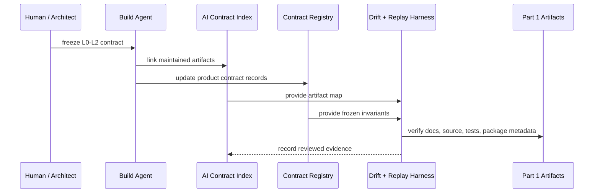

# Agent DevOps

This directory is the AI-native development system for this repository. It is
repo-published but not included in the npm package.

Part 1 of the repository is the product package: product narrative, PRD,
source, CLI, product architecture, product contracts, product tests, product
harness scripts, and open-source usage docs. Part 2 is this directory: build
governance, contract indexing, drift checks, and governance/replay harness guidance for
agent-maintained work.

Part 1 runtime code, public API, and npm package contents must not depend on
this directory. This directory may index part 1 product narrative, PRD,
contracts, source files, tests, package metadata, and product harness commands
as development evidence. It does not own product L0 intent.

## Files

- [requirements-to-code-chain.md](./requirements-to-code-chain.md): durable
  L0-L4 development protocol for agent-maintained repository work.
- [ai-contract-index.md](./ai-contract-index.md): development index mapping
  upstream contracts to maintained artifacts and harness evidence.
- [sops/agentic-interaction-change.md](./sops/agentic-interaction-change.md):
  repo workflow for changing interaction behavior without collapsing product
  architecture into local renderer or keyword patches.
- [sops/channel-formatting-and-adaptation.md](./sops/channel-formatting-and-adaptation.md):
  reusable patterns and anti-patterns for channel formatting, carrier lowering,
  replay evidence, and future channel adaptation work.

## Governance Harness Flow

## Boundary Rules

- Product docs and diagrams live in `README.md` and `architecture/`.
- Devops docs and diagrams live here.
- Product runtime imports must not cross into `agent-devops/`.
- Development checks may read both `architecture/` and `agent-devops/`.
- `pnpm public-safety-check` is a repo-public hygiene gate. It scans public
  tracked and untracked files for real-looking provider ids, local paths,
  session ids, token patterns, and optional local private denylist terms.
- `pnpm dependency-audit` rejects known production dependency vulnerabilities.
  `pnpm package-safety-check` scans the exact `npm pack --dry-run` file list,
  including generated package artifacts after build.
- `pnpm test:coverage` uses the isolated test harness and enforces the
  repository coverage baseline for statements, branches, functions, and lines.
- npm package contents should remain product-facing unless an explicit release
  decision changes that boundary.
- Keep diagrams layered. If a devops diagram needs nested subgraphs or mixes
  contract freeze, indexing, drift checks, replay, and package evidence, split
  it into several smaller diagrams with explicit layer titles.
