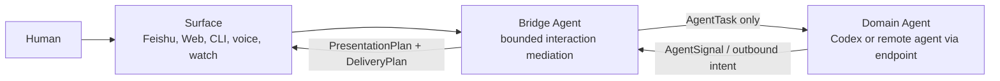
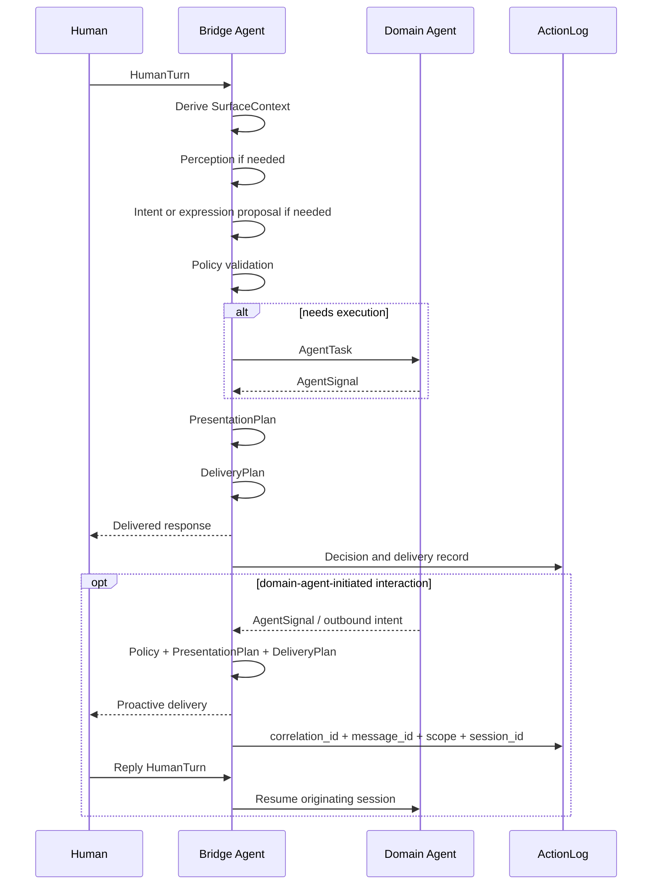

# Agentic Bridge Ontology

Status: target architecture
Scope: global architecture for a bounded bridge agent
Date: 2026-05-29

This document defines the target product architecture for an AI-native bridge.
It is not a description of the current implementation. Future refactors should
use this document as the product ontology target before moving code.

## Core Thesis

Agent-Interaction-Bridge should be treated as a bounded bridge agent, not as a
traditional passive gateway with AI API calls and not as the domain agent that
owns task reasoning.

The bridge owns interaction mediation: perception, context interpretation,
expression planning, multimodal transformation, delivery quality, correlation,
and feedback evidence. Domain agents own task reasoning, tools, risk judgment,
and their execution sessions.

## Why A Bridge Agent Mediates Domain Agents

The bridge does not exist to add a transport wrapper around a domain agent.
It exists because the human-interaction problem and the task-execution problem
have different objectives, risks, state, and capabilities.

Domain agents are optimized for reasoning over tasks, using tools, editing
files, running commands, and maintaining execution sessions. Human-facing
surfaces need a different agentic layer: one that understands the speaker, the
device, the channel, the available presentation forms, prior feedback,
multimodal inputs, density budgets, and delivery quality.

Directly exposing domain agents to human channels creates structural
coupling:

- channel payloads become mixed with execution prompts
- presentation feedback becomes confused with task retry
- multimodal perception becomes mixed with filesystem or shell authority
- model helper resources look like endpoint capabilities
- channel-specific UX leaks into endpoint session semantics
- endpoint changes can break human-facing product behavior

The bridge agent is therefore an anti-corruption layer, a capability governor,
and a product interaction layer. It mediates domain agents by creating typed
objects and bounded contracts between humans and task executors:

```text
HumanTurn
  -> Bridge Agent
     -> AgentTask
        -> Domain Agent
     <- AgentSignal
  <- PresentationPlan / DeliveryPlan
```

The direction may also start from the Domain Agent. Its outbound intent still
enters Bridge policy, presentation, carrier delivery, and ActionLog. Bridge
preserves `correlation_id -> message_id -> scope -> session_id` so a later
HumanTurn can resume the originating Domain Agent session.

This proxying is not pass-through forwarding. The bridge may perceive,
summarize, retrieve memory, plan expression, generate artifacts, evaluate
quality, and choose a delivery plan. It must not execute tools, approve risk,
mutate endpoint profiles, or replace domain-agent judgment.

## Agent Roles

| Role | Responsibility | Authority |
| --- | --- | --- |
| Human Operator | Identity, credentials, publishing, exposure, product direction | Final authority |
| Bridge Agent | Mediates turns, surfaces, expression needs, correlation, delivery, and audit evidence | Product Runtime interaction authority |
| Domain Agent | Reasons about tasks, uses tools, edits files, runs commands, and continues task sessions | Explicit endpoint profile authority |
| Capability Provider | Supplies language, vision, embedding, image, voice, storage, or compute ability | No independent authority |

## State Boundaries

State must be explicit because the bridge is an agentic system. Hidden state is
where product behavior, security boundaries, and debugging evidence become
unreliable.

State classes:

| Class | Meaning | Rule |
| --- | --- | --- |
| `stateless` | No bridge-owned memory survives the call | Safe to retry from the same inputs |
| `bounded-state` | State is scoped to turn, session, endpoint profile, message id, or short retry window | Must declare owner, key, and cleanup rule |
| `durable-state` | State persists under runtime home or an explicit operator-provided store | Must be cataloged, auditable, and excluded from git |
| `external-provider-state` | Opaque state held by a model, channel, or remote provider | Bridge must not rely on it for correctness |

Runtime services own base capabilities such as profiles, resources, sessions,
artifacts, vectors, and ActionLog storage. They are a support plane for runtime
domains, not a shared memory surface between agents. Agents do not share raw
resources, stores, provider handles, or sessions with each other.

### Service State

| Service | State class | State owner | Notes |
| --- | --- | --- | --- |
| Human channel receiver | `bounded-state` | Carrier adapter | Message ids, retries, and quoted context refs only |
| Bridge orchestration runtime | `bounded-state` | Bridge runtime | In-flight turns, pending queues, process registry, scoped sessions |
| SurfaceContext derivation | `stateless` | None | Pure interpretation of event metadata and channel capability |
| Perception service | `stateless` by default | Capability boundary | May write artifacts only through ArtifactStore |
| InteractionIntent classifier | `stateless` | Bridge agent | May call model helper; must return typed result |
| ExpressionProfile planner | `stateless` with optional reads | Bridge agent | May read memory; writes decisions only through ActionLog |
| Presentation planner | `stateless` with optional reads | Bridge agent | Lowers intent, expression, surface, policy, and resource state |
| Carrier renderer | `stateless` | Carrier adapter | Pure lowering from DeliveryPlan to payload |
| Carrier delivery adapter | `bounded-state` | Carrier adapter | Tracks send/update ids, retries, and delivery status |
| Outbound interaction correlation | `bounded-state` | Bridge runtime | Maps correlation id, carrier message id, conversation scope, and originating domain-agent session id; ActionLog keeps durable audit evidence |
| Policy/profile resolver | `stateless` over durable config | Policy layer | Reads endpoint profile and operator config |
| ActionLog service | `durable-state` | Runtime Services | Append-only decision and delivery evidence |
| ArtifactStore | `durable-state` | Runtime Services | Artifact files plus metadata manifest |
| Vector retrieval service | `durable-state` | Runtime Services | Vector-backed retrieval support state |
| CapabilityCatalog | `durable-state` | Runtime Services | Declares available cognitive capabilities and module bindings |
| ResourceCatalog | `durable-state` | Runtime Services | Declares required compute, storage, and model resources |
| Execution endpoint adapter | `bounded-state` | Endpoint profile | App-server pools, exec invocations, and session handles |
| Execution endpoint runtime | `durable-state` or `bounded-state` | Endpoint profile | Codex home, sessions, workspaces, approval state, process state |

### Resource State

| Resource | State class | Bridge rule |
| --- | --- | --- |
| Helper language model | `stateless` bridge call, possible `external-provider-state` | Do not rely on provider memory; require typed proposals |
| Helper vision model | `stateless` bridge call, possible `external-provider-state` | Do not persist raw media unless ArtifactStore records it |
| Helper embedding model | `stateless` bridge call, possible `external-provider-state` | Embedding output may enter VectorStore only through memory policy |
| Helper image generation model | `stateless` bridge call, possible `external-provider-state` | Generated image becomes durable only after ArtifactStore commit |
| Helper voice model | `stateless` bridge call, possible `external-provider-state` | Transcript/audio artifacts require explicit artifact policy |
| Model provider credentials | `durable-state` | Encrypted runtime secret; never committed or exposed to endpoint capabilities |
| Runtime config | `durable-state` | Local operator state under runtime home |
| Secrets store | `durable-state` | Encrypted local state, never printed in normal diagnostics |
| Artifact filesystem | `durable-state` | Runtime Services home only, with manifest metadata |
| Artifact metadata manifest | `durable-state` | Runtime Services home only, audit-friendly metadata |
| Vector index | `durable-state` | Runtime Services retrieval state; not endpoint session memory |
| Vector fallback store | `durable-state` | Runtime Services retrieval state; not endpoint session memory |
| Process registry | `bounded-state` with durable evidence | Runtime data | Operational status, not semantic memory |
| Channel platform state | `external-provider-state` | Store only needed refs locally; do not assume channel keeps bridge semantics |
| Domain-agent session | `durable-state` or `bounded-state` | Endpoint profile state; not bridge helper-model memory |

State inheritance is forbidden by default. A stateful bridge resource does not
become domain-agent memory, and a stateful domain-agent endpoint does not become
bridge semantic memory unless policy maps it into a typed object. Runtime
services may hold all stores in one operator home, but access is scoped by owner,
key, and profile.

## Topology



Runtime Services are the support plane for profiles, resources, sessions,
ActionLog, artifacts, vectors, and other runtime state stores.

## Ontology Objects

### HumanTurn

One inbound unit from a human surface.

Fields:

- `turnId`
- `actorId`
- `surfaceId`
- `text`
- `attachments`
- `quotedContext`
- `timestamp`
- `rawCarrierRefs`

Owns inbound facts only. It must not own interpretation or rendering.

### SurfaceContext

The environment where the turn happened and where the answer will be consumed.

Fields:

- `channel`: `feishu`, `web`, `cli`, `voice`, `mac`, `a2a`
- `deviceClass`: `desktop`, `mobile`, `watch`, `voice_only`, `unknown`
- `inputMode`: `text`, `voice`, `image`, `mixed`
- `outputCapabilities`: text, markdown, card, html, image, file, voice
- `densityBudget`: tiny, compact, normal, expanded
- `interactionLatency`: realtime, async, batch

Surface context is not user intent. A watch surface can force compact delivery
without changing what the user asked.

### InteractionIntent

The meaning of the human turn as a conversational act.

Allowed classes:

- `task_request`
- `presentation_feedback`
- `retry_request`
- `context_update`
- `status_question`
- `approval_response`
- `correction`

It must not decide card layout, HTML output, image generation, or execution
authority.

### PerceptionResult

Structured interpretation of multimodal input.

Examples:

- screenshot summary
- detected chart/table/UI state
- voice transcript and confidence
- attachment inventory
- visual defects described by the user

It may be generated by vision, speech, OCR, or language capabilities.

### ExpressionProfile

The semantic expression shape the content deserves before carrier rendering.

Examples:

- `architecture_explanation`
- `project_progress_report`
- `market_analysis`
- `comparison`
- `incident_review`
- `timeline`
- `decision_brief`
- `watch_summary`
- `voice_reply`
- `artifact_preview`

ExpressionProfile is where Dynamic UI belongs. It is independent of Feishu,
Markdown, or any carrier payload.

### Capability

A bounded cognitive or execution capability.

Capability categories:

- `perception.language`
- `perception.vision`
- `perception.audio`
- `memory.embedding`
- `memory.vector_search`
- `expression.transform`
- `expression.image_generation`
- `expression.voice_generation`
- `quality.evaluation`
- `execution.agent_endpoint`

Each capability must declare:

- input type
- output type
- state boundary
- authority boundary
- failure mode
- audit fields

### TypedProposal

The only allowed output shape for bridge helper model judgment.

Required fields:

- `proposalType`
- `schemaVersion`
- `confidence`
- `evidence`
- `recommendedAction`
- `rejectedAlternatives`
- `policyNotes`

Helper models may propose. Policy and deterministic planners decide.

### PresentationPlan

The channel-neutral display plan.

Fields:

- `expressionProfile`
- `layout`
- `sections`
- `density`
- `artifactRequests`
- `fallback`
- `qualityChecks`

It must not own carrier send APIs or domain-agent behavior.

### InteractionTurnPlan

The channel-neutral ordered prompt plan for one human turn.

Fields:

- gateway mode
- channel
- typed ordered sections
- InteractionIntent
- optional ExpressionProfile
- optional PresentationPlan

The plan remains structured through policy and approval handling. A single
deterministic renderer lowers it at the execution endpoint boundary. Carrier
routing ids remain in Bridge state unless Domain Agent reasoning explicitly
needs them.

For Feishu/Lark, the final presentation projects existing Bridge scope and
Domain session/thread references into a compact observability footer. This is a
display rule over existing state, not a new ontology object or routing input.

### DeliveryPlan

The channel-specific plan created from a PresentationPlan and SurfaceContext.

Fields:

- `carrier`
- `payloadKind`
- `messageUpdateMode`
- `artifactUploads`
- `fallbackPayload`
- `retryPolicy`

### AgentTask

A task delegated to a domain agent through an execution endpoint.

Fields:

- `taskId`
- `instruction`
- `endpointProfile`
- `sessionScope`
- `riskTags`
- `approvalState`

The bridge may create AgentTask objects, but it does not perform the execution
itself.

### AgentSignal

Stable information emitted by a domain agent or bridge processing.

Examples:

- progress
- final answer
- artifact ready
- proactive outbound intent
- risk approval required
- failed
- needs human input

Endpoint-native signals and explicit interaction requests may become proactive,
reply-correlated interaction. Signals derived by Bridge from a tool result are
same-turn presentation enrichment only: they retain their AgentSignal semantic
kind but do not create proactive correlation or resumable reply authority.

### ActionLog

An audit object for decisions and state transitions.

Records:

- inbound turn
- perception outputs
- model capabilities used
- typed proposals
- planner decisions
- policy gates
- endpoint tasks
- outbound correlation from domain-agent intent to carrier message, scope, and session
- delivery result
- reply correlation and one-time reply consumption
- originating-session resume success or failure
- user feedback

ActionLog is the source for future learning and debugging.

## Capability Governance

| Capability | Allowed | Forbidden |
| --- | --- | --- |
| Language model | intent support, summarization, expression planning, quality evaluation | tool choice, shell execution, approval decisions |
| Vision model | screenshot/image understanding, visual defect detection | filesystem or browser control |
| Embedding model | memory retrieval, similar incident lookup, preference recall | endpoint memory injection without policy |
| Image model | presentation artifacts | changing task result or claiming execution evidence |
| Voice model | voice input/output transformation | identity, credential, or approval substitution |
| Domain-agent endpoint | task reasoning and tools under profile | carrier rendering, credential ownership |

## Processing Loop



## Design Rules

1. Start with ontology objects, not handlers.
2. Use models when the step requires perception, semantic judgment,
   transformation, retrieval, generation, or quality evaluation.
3. Require typed proposals from helper models.
4. Validate every proposal against policy and surface capability.
5. Keep domain-agent execution authority behind explicit endpoint profiles.
6. Record bridge decisions as ActionLog objects.
7. Route both human-initiated and domain-agent-initiated interaction through the
   bridge, with correlation and audit evidence.
8. Test the ontology transition, not only the rendered payload.

## Palantir Concepts Adapted

This architecture borrows the following ideas from Palantir's public Foundry
and AIP documentation:

- Ontology as operational layer, not just schema.
- Objects, properties, links, actions, functions, and security as one operating
  model.
- Actions and action logs as auditable decision objects.
- LLM functions with explicit inputs, outputs, evaluation, monitoring, and
  permissions.

It does not require copying Palantir's platform. The bridge needs a local,
lightweight ontology that makes agent behavior explicit and testable.

References:

- https://www.palantir.com/docs/foundry/ontology/overview
- https://www.palantir.com/docs/foundry/action-types/action-log
- https://www.palantir.com/docs/foundry/logic/overview
- https://www.palantir.com/docs/foundry/action-types/rules
- https://www.palantir.com/docs/foundry/aip/overview
