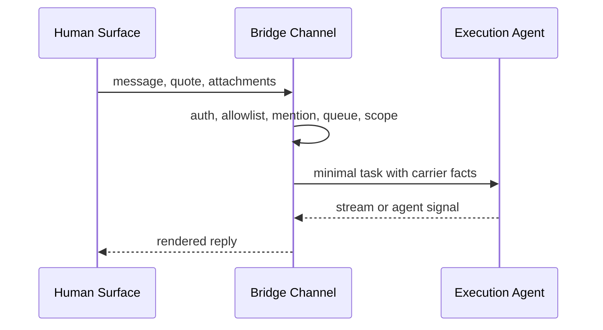
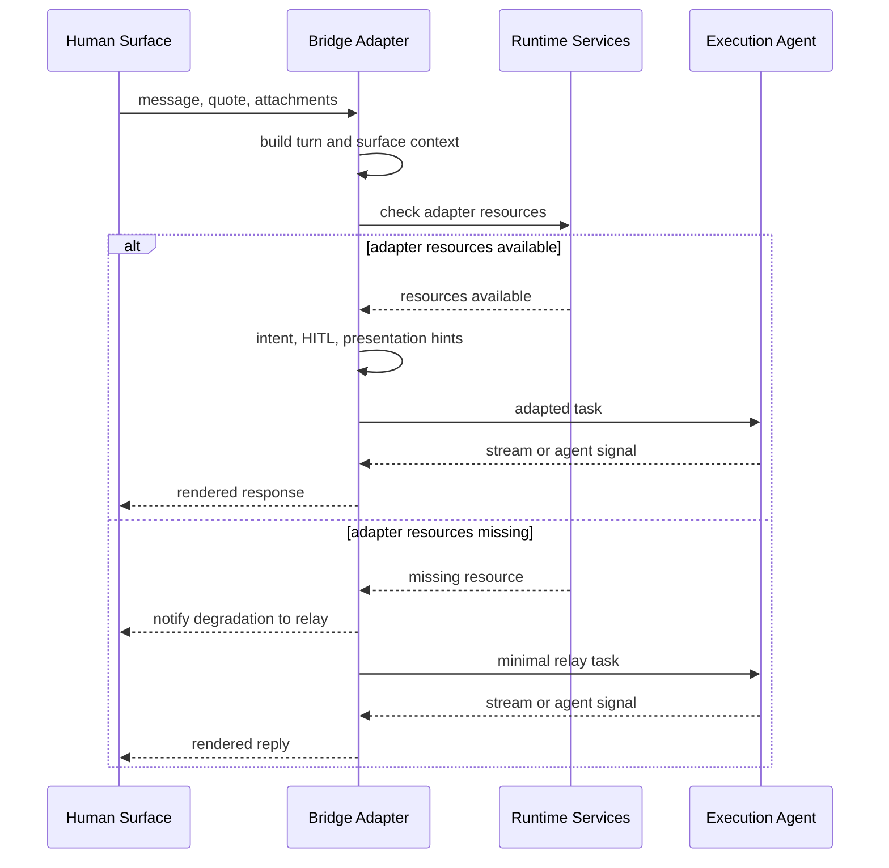
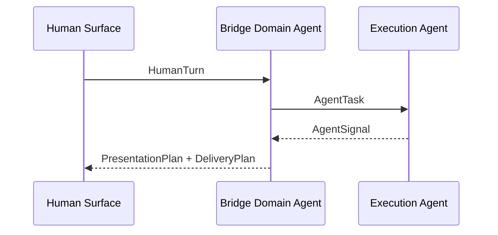
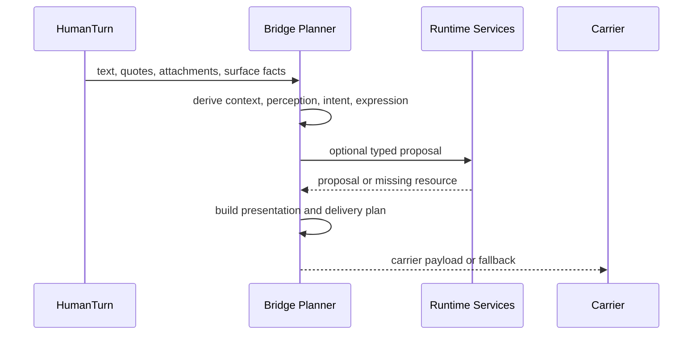
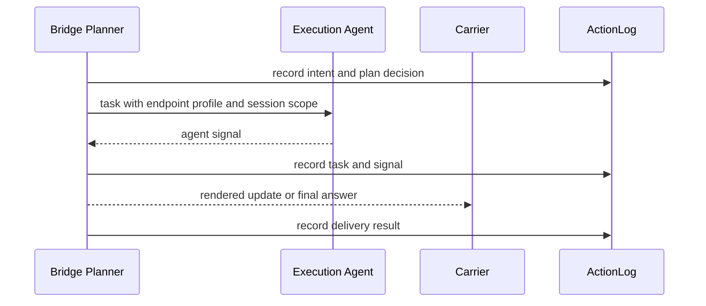

# System Design

Status: target system design aligned to
[agentic-ontology.md](./agentic-ontology.md).

## Mission

Agent-Interaction-Bridge is a local-first bounded interaction agent. It mediates
between human surfaces and execution agents by keeping meaning, capability,
state, presentation, delivery, and execution authority as separate objects.

```text
human surface
  -> bridge domain agent
     -> execution agent
  -> surface-aware delivery
```

The current runtime path is Feishu/Lark to a local Codex endpoint. Future paths
include Mac, Web, CLI, voice, watch, A2A, and remote execution agents.

## Gateway Modes

The bridge supports two operator-selectable gateway modes. The mode changes
only how much gateway-side interpretation and presentation assistance is
applied; it does not change the selected execution endpoint, endpoint profile,
Runtime Services boundary, or channel access gates.

### Relay Mode

`relay` is the channel-to-agent relay path. Bridge keeps its channel duties:
app credential resolution, access control, allowed chats, mention policy,
debounced queueing, cwd/session resume, attachment and quote transport,
endpoint profile policy, approvals when explicitly required, stream rendering,
and channel delivery.

In this mode bridge must not run complex intent classification, helper-model
intent judgment, Dynamic UI routing, presentation planning, presentation
delivery support, or rich expression transforms. The agent receives the user's
task text plus only minimal carrier facts needed to preserve quoted context and
local attachment paths.

### Relay Flow



Relay execution steps:

1. Resolve credentials, access, chat allowlist, mention policy, and scope.
2. Debounce messages and collect text, quotes, and local attachment paths.
3. Build a minimal `AgentTask` without bridge context blocks, interaction
   protocol injection, helper-model judgment, or presentation hints.
4. Run the selected execution endpoint with the current cwd/profile/session.
5. Render the endpoint stream back to the channel.

### Adapter Mode

`adapter` is the bounded interaction-agent path. Bridge may
derive `SurfaceContext`, classify `InteractionIntent`, inject interaction and
presentation protocol guidance, apply reply-mode hints, use Runtime Services
helper resources for stateless typed proposals or artifacts, and lower
`PresentationPlan` into channel-specific delivery.

This is the default mode for missing or invalid config values. A channel can use
`/gatewayMode relay|adapter|default` to set a current-session override. If
Runtime Services adapter resources are unavailable, requested `adapter` mode
must visibly degrade to `relay` and notify the channel.

Operator status surfaces must show the selected mode explicitly. The mode is a
bridge interpretation setting only; switching modes must not change Runtime
Services resource ownership, storage names, endpoint profile, or execution
agent authority.

### Adapter Flow



Adapter execution steps:

1. Resolve the same channel duties as relay.
2. Resolve the effective gateway mode from session override or global default.
3. Check Runtime Services adapter resources.
4. If adapter resources are missing, notify the channel and use the relay flow
   for this run.
5. If adapter resources are available, classify intent, apply HITL and
   presentation guidance, and build an adapted `AgentTask`.
6. Run the selected execution endpoint without changing endpoint authority.
7. Lower agent signals through presentation and delivery support when available,
   then render to the channel.

## Product Runtime

The Bridge Domain Agent owns human-channel interpretation, surface awareness,
perception, expression planning, memory retrieval, delivery quality, and
feedback learning. It does not own risky task execution.



Runtime Services are the support plane for profiles, resources, sessions,
ActionLog, artifacts, vectors, and other runtime state stores.

Runtime services own base capabilities such as profiles, resources, sessions,
artifacts, vectors, and ActionLog storage. They are a support plane for all
runtime domains, not an execution agent and not a shared memory surface between
agents. Agents do not share raw resources or sessions with each other.

## Layered Object Flow

Keep each product architecture diagram to one concern, but do not split so far
that every diagram repeats the same objects. The object flow has two readable
layers: planning, then optional execution and evidence.

### Planning Layer

The bridge turns inbound facts into a channel-ready plan. Helper resources may
propose, but policy and deterministic planning decide what is accepted.



### Execution Layer

The bridge delegates work only when the request needs endpoint reasoning or
tools. Evidence is recorded around delegation, endpoint signals, and final
delivery.



## Design Direction

- Treat the bridge as a bounded interaction agent, not as a passive gateway with
  AI API calls when `adapter` is selected; keep `relay` for operators who want
  only channel-to-agent relay while preserving channel duties.
- Keep Feishu/Lark as the first carrier, not the architecture boundary.
- Keep Codex as the first execution agent, not the only endpoint type.
- Move visual, report, comparison, watch, voice, and other expression choices
  into `ExpressionProfile` and `PresentationPlan`, not `InteractionIntent`.
- Add `SurfaceContext` before presentation planning so device and channel
  constraints affect expression without changing task meaning.
- Add `CapabilityCatalog` above `ResourceCatalog`: capabilities describe what
  the bridge can cognitively do; resources describe whether the operator has
  provided the needed implementation.
- Keep profiles, resources, sessions, artifacts, vectors, and ActionLog storage
  in runtime services. Agents must not reuse raw state across agent boundaries.
- Require helper models to return typed proposals. Policy and deterministic
  planners decide whether proposals are accepted.
- Mark every service and resource as `stateless`, `bounded-state`,
  `durable-state`, or `external-provider-state`.
- Record bridge decisions in `ActionLog` so quality failures can be debugged and
  learned from.
- Keep gateway mode decisions auditable through config schema tests,
  prompt-planning tests, and end-to-end channel-to-agent replay tests.

## Evolution Check

Before adding or changing a feature, classify it by ontology object:

| Concern | Owner |
| --- | --- |
| Inbound facts | `HumanTurn` |
| Channel, device, input/output capability | `SurfaceContext` |
| Screenshot, audio, file, visual observation | `PerceptionResult` |
| Conversational act or feedback meaning | `InteractionIntent` |
| Desired semantic expression shape | `ExpressionProfile` |
| Model recommendation | `TypedProposal` |
| Channel-neutral display plan | `PresentationPlan` |
| Carrier-specific delivery plan | `DeliveryPlan` |
| Execution delegation | `AgentTask` |
| Execution result | `AgentSignal` |
| Authority, profile, HITL, resource exposure | `Policy` |
| Cognitive ability | `CapabilityCatalog` |
| Operator-provided compute, storage, model binding | `ResourceCatalog` |
| Persistent evidence or learning | `ActionLog` |
| Profiles, resources, sessions, and state stores | Runtime services |

Reject changes that skip this classification, mix provider payloads into
generic runtime objects, or let helper models become execution authority.

## Layer Contracts

Concrete L2 records live in `architecture/contracts/*.yaml`. This file owns the
system-level vocabulary used by those records.

### HumanTurn

Owns inbound human facts: text, attachments, quotes, timestamps, actor refs, and
raw carrier refs. It must not own interpretation or rendering.

### SurfaceContext

Owns channel, device, input mode, output capabilities, density budget, latency
budget, and carrier constraints. It changes expression and delivery, not task
meaning.

### PerceptionResult

Owns structured interpretation of multimodal input such as screenshots, charts,
tables, voice transcripts, attachment inventory, and visual defects. It may use
language, vision, speech, OCR, or embedding capabilities.

### InteractionIntent

Owns the conversational act: task request, presentation feedback, retry request,
context update, status question, approval response, or correction. It must not
decide card layout, Dynamic UI, image generation, carrier payload, or execution
authority.

### ExpressionProfile

Owns the semantic expression shape, such as architecture explanation, project
progress report, market analysis, comparison, timeline, decision brief, watch
summary, or voice reply. Dynamic UI belongs here.

### CapabilityCatalog

Owns the cognitive capability map: language, vision, audio, embedding, vector
search, expression transform, image generation, voice generation, quality
evaluation, and execution endpoint delegation. Each capability declares input
type, output type, state boundary, authority boundary, failure mode, and audit
fields.

### ResourceCatalog

Runtime Services own availability of operator-provided compute, storage, and
model resources. Missing resources must remain explicit stubs or
`missing_resource` typed results. Resource availability does not grant execution
authority or create a shared raw resource between agents.

### TypedProposal

Owns helper-model recommendations. Required fields include proposal type,
schema version, confidence, evidence, recommended action, rejected
alternatives, and policy notes. Helper models may propose. Policy and planners
decide.

### PresentationPlan

Owns channel-neutral display intent: expression profile, layout, sections,
density, artifact requests, fallback, and quality checks. It must not own
carrier send/update APIs or execution-agent behavior.

### DeliveryPlan

Owns carrier-specific lowering from PresentationPlan and SurfaceContext:
carrier, payload kind, update mode, artifact uploads, fallback payload, and
retry policy.

### Carrier

Owns concrete transport details such as Feishu card or markdown send/update,
Mac notification, Web rendering, CLI output, voice reply, or file upload. It
must not reinterpret intent or change execution policy.

### AgentTask

Owns execution delegation: instruction, endpoint profile, session scope, risk
tags, approval state, and task id. It is the only path from the bridge domain
agent into execution agents.

### AgentSignal

Owns stable information emitted by execution agents or bridge processing:
progress, final answer, artifact ready, risk approval required, failure, or
needs-human-input.

### Policy

Owns authority, access, HITL, audit, routing, endpoint profiles, resource
exposure, and state inheritance rules. It validates proposals and task
delegation.

### Execution Agent

Owns reasoning, tool use, workspace access, session continuation, file edits,
commands, and endpoint runtime state under an explicit profile. It must not own
human channel protocol, presentation formatting, carrier callbacks, or bridge
helper-model capabilities.

### ActionLog

Owns durable evidence of inbound turns, perception outputs, capability use,
typed proposals, accepted and rejected alternatives, policy gates, endpoint
tasks, delivery result, and user feedback.

### Runtime Data

Owns local operator state outside the repository:
`~/.agent-interaction-bridge/` config, bridge app secrets, sessions,
workspaces, process registries, media, and logs. Runtime Services state lives
under `~/.agent-runtime-services/` by default and owns model-provider config,
model secrets, artifacts, sqlite manifests, vector indexes, and model smoke
state. Runtime state must not be committed.

### Runtime Services

Own profiles, resource bindings, state stores, session handles, and the
canonical capability registry. They are base platform capabilities, not agent
capabilities and not bridge Product Runtime modules. Bridge consumes them
through `src/runtime-services/port.ts` and the explicit transport selector in
`src/runtime-services/selector.ts`. Business code depends only on
`RuntimeServicesPort`; local JSON-RPC `/rpc` is the current resource path, and
preserved MCP code is future transport scaffolding. Provider, artifact, vector,
and generic secret-resolver implementations stay outside bridge Product Runtime
code. Bridge config may carry only caller-owned names such as
`runtimeServices.artifact_namespace`, `runtimeServices.vector_tableName`,
`runtimeServices.record_namespace`, and `runtimeServices.record_tableName`;
those names are sent to Runtime Services as JSON-RPC params and do not create
bridge-owned storage. Unit tests may inject a
mock `RuntimeServicesPort`, but production code must not create an in-process
Runtime Services instance. Bridge, helper-model, carrier, and endpoint-profile
access must stay separated unless policy maps state into a typed object.
