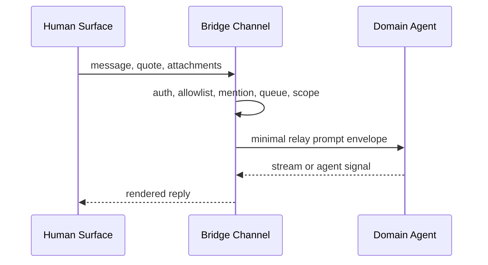
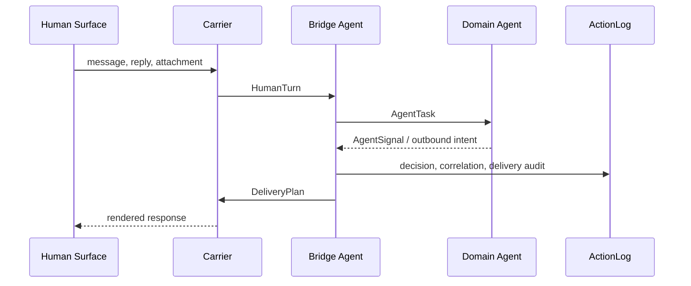
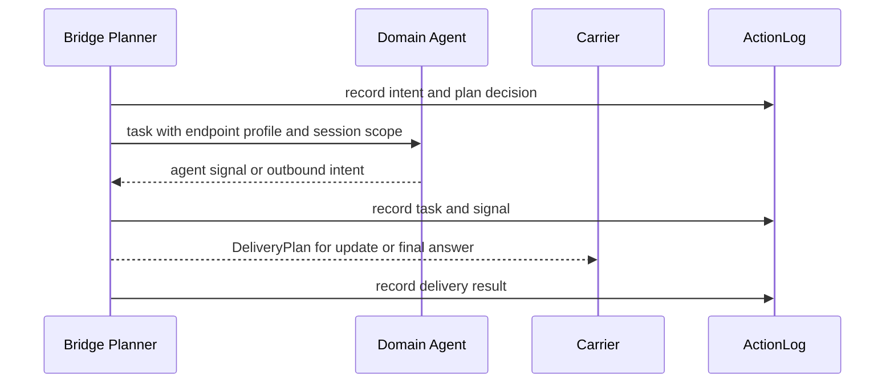

# System Design

Status: target system design aligned to
[agentic-ontology.md](./agentic-ontology.md).

## Mission

Agent-Interaction-Bridge is a local-first bounded interaction bridge agent. It
mediates between human surfaces and domain agents by keeping meaning, capability,
state, presentation, delivery, and execution authority as separate objects.

```text
human surface <-> bridge agent <-> domain agent
                  -> surface-aware delivery
```

The current runtime path is bidirectional between Feishu/Lark and a local Codex
domain agent through the bridge. Future paths include Mac, Web, CLI, voice,
watch, A2A, and remote domain agents.

## Gateway Modes

The bridge supports two operator-selectable gateway modes. The mode changes
only how much gateway-side interpretation and presentation assistance is
applied; it does not change the selected execution endpoint, endpoint profile,
Runtime Services boundary, or channel access gates.

### Relay Mode

`relay` is the channel-to-agent relay path. Bridge keeps its channel duties:
app credential resolution, access control, allowed chats, mention policy,
debounced queueing, cwd/session resume, attachment and quote transport,
endpoint profile policy, approvals when explicitly required, stream rendering,
and channel delivery.

In this mode bridge must not run complex intent classification, helper-model
intent judgment, Dynamic UI routing, presentation planning, presentation
delivery support, or rich expression transforms. The agent receives the user's
task in one canonical relay prompt envelope: the plain-text response template
plus only the carrier facts needed to preserve quoted context, mention names,
and local attachment paths. It omits adapter-only protocol, bridge-context,
intent, and presentation-plan sections.

### Relay Flow



Relay execution steps:

1. Resolve credentials, access, chat allowlist, mention policy, and scope.
2. Debounce messages and collect text, quotes, and local attachment paths.
3. Build the minimal relay prompt envelope without adapter-only interaction
   protocol, bridge context, helper-model judgment, intent, or presentation
   sections.
4. Run the selected execution endpoint with the current cwd/profile/session.
5. Render the endpoint stream back to the channel.

### Adapter Mode

`adapter` is the bounded bridge-agent path. Bridge may
derive `SurfaceContext`, classify `InteractionIntent`, inject interaction and
presentation protocol guidance, apply reply-mode hints, use Runtime Services
helper resources for stateless typed proposals or artifacts, and lower
`PresentationPlan` into channel-specific delivery.

This is the default mode for missing or invalid config values. A channel can use
`/gatewayMode relay|adapter|default` to set a current-session override. If
Runtime Services adapter resources are unavailable, requested `adapter` mode
must visibly degrade to `relay` and notify the channel.

Operator status surfaces must show the selected mode explicitly. The mode is a
bridge interpretation setting only; switching modes must not change Runtime
Services resource ownership, storage names, endpoint profile, or execution
domain-agent authority.

### Adapter Flow


Adapter execution steps:

1. Resolve the same channel duties as relay.
2. Resolve the effective gateway mode from session override or global default.
3. Check Runtime Services adapter resources.
4. If adapter resources are missing, notify the channel and use the relay flow
   for this run.
5. If adapter resources are available, classify intent, apply HITL and
   presentation guidance, and build the adapter prompt envelope for its
   `AgentTask`.
6. Run the selected execution endpoint without changing endpoint authority.
7. Lower agent signals through presentation and delivery support when available,
   then render to the channel.

## Product Runtime

The Bridge Agent owns interaction mediation: human-channel interpretation,
surface awareness, perception, expression planning, delivery quality,
correlation, and feedback evidence. The Domain Agent owns task reasoning, tool
use, risk judgment, and its execution session.



Both directions use the same interaction boundary. When a Domain Agent starts
an outbound interaction, Bridge applies policy and delivery planning, records
the send in ActionLog, and preserves
`correlation_id -> message_id -> scope -> session_id`. A human reply resolves
that chain before session lookup and resumes the originating Domain Agent task.
`reply_correlated`, `reply_consumed`, and `resume_succeeded` or `resume_failed`
are separate ActionLog outcomes; claiming a reply never proves that the endpoint
continued it.

Every normal Feishu/Lark response also projects the current Bridge conversation
scope and Domain Agent session/thread reference into a presentation-only footer.
The footer uses existing state references, displays the final 8 characters of a
longer Bridge scope identifier and the first 8 characters of a longer Domain
session/thread identifier, leaves shorter values unchanged, and omits ellipses
and decoration. When the reply belongs to a current or completed task, it also
projects that task's elapsed runtime using compact minute/second notation. It
renders one
`Session：📥 - <id> | 🤖 - <id> | ⏳ - <duration>` line, where 📥 projects the
Bridge scope, 🤖 projects the Domain Agent thread, and ⏳ projects elapsed task
time. Replies without task timing omit the duration segment. Markdown and card
lowering uses a `>` quote block while plain-text lowering omits quote syntax.
It grants no routing, session, or lifecycle authority.

Existing Domain Agent thread binding is an explicit operator workflow, not
presentation observability. Bridge first applies endpoint-profile policy, asks
the selected endpoint adapter for saved threads in the resolved cwd, and lets
the human choose one. Before persisting the reference, Bridge re-reads the
thread through the same profile and rejects missing, cwd-mismatched, ephemeral,
or active threads. Discovery previews prefer endpoint `thread.name`, then
`thread.preview`, then `(空会话)`. Deterministic lowering first extracts the
canonical `<user_message>` body, falls back to removing legacy Bridge-owned
prompt prefixes, collapses whitespace, and caps the result at 200 Unicode
characters. It does not load turns or invoke a helper model. The Bridge session
store keeps only the validated thread reference, resolved cwd, runtime/profile
key, and context version; it never parses, copies, or owns Codex rollout files.
P0 continues the selected thread on the next Feishu/Lark turn, but does not
provide live Codex Desktop co-control or cross-process steering.

Runtime Services are the support plane for profiles, resources, sessions,
ActionLog, artifacts, vectors, and other runtime state stores.

Runtime services own base capabilities such as profiles, resources, sessions,
artifacts, vectors, and ActionLog storage. They are a support plane for all
runtime domains, not a domain agent and not a shared memory surface between
agents. Agents do not share raw resources or sessions with each other.

## Layered Object Flow

Keep each product architecture diagram to one concern, but do not split so far
that every diagram repeats the same objects. The object flow has two readable
layers: planning, then optional execution and evidence.

### Planning Layer

The bridge turns inbound facts into a channel-ready plan. Helper resources may
propose, but policy and deterministic planning decide what is accepted.


### Execution Layer

The bridge delegates work only when the request needs endpoint reasoning or
tools. Evidence is recorded around delegation, endpoint signals, and final
delivery.



## Design Direction

- Treat the bridge as a bounded bridge agent, not as a passive gateway with
  AI API calls when `adapter` is selected; keep `relay` for operators who want
  only channel-to-agent relay while preserving channel duties.
- Keep Feishu/Lark as the first carrier, not the architecture boundary.
- Keep Codex as the first domain agent and exec/app-server as its current
  endpoint implementations, not as the generic agent-role definition.
- Move visual, report, comparison, watch, voice, and other expression choices
  into `ExpressionProfile` and `PresentationPlan`, not `InteractionIntent`.
- Keep `InteractionTurnPlan` structured through policy and approval handling.
  One deterministic renderer lowers its ordered sections only at the execution
  endpoint handoff; prompt assembly must not be split across carrier, intent,
  and endpoint string wrappers.
- Bind pending approvals to the gateway mode and session context version that
  produced their `AgentTask`. A mode or context-version change makes the
  approval stale and must fail closed before endpoint execution.
- Add `SurfaceContext` before presentation planning so device and channel
  constraints affect expression without changing task meaning.
- Add `CapabilityCatalog` above `ResourceCatalog`: capabilities describe what
  the bridge can cognitively do; resources describe whether the operator has
  provided the needed implementation.
- Keep profiles, resources, sessions, artifacts, vectors, and ActionLog storage
  in runtime services. Agents must not reuse raw state across agent boundaries.
- Require helper models to return typed proposals. Policy and deterministic
  planners decide whether proposals are accepted.
- Mark every service and resource as `stateless`, `bounded-state`,
  `durable-state`, or `external-provider-state`.
- Record bridge decisions in `ActionLog` so quality failures can be debugged and
  learned from.
- Keep gateway mode decisions auditable through config schema tests,
  prompt-planning tests, and end-to-end channel-to-agent replay tests.

## Evolution Check

Before adding or changing a feature, classify it by ontology object:

| Concern | Owner |
| --- | --- |
| Inbound facts | `HumanTurn` |
| Channel, device, input/output capability | `SurfaceContext` |
| Screenshot, audio, file, visual observation | `PerceptionResult` |
| Conversational act or feedback meaning | `InteractionIntent` |
| Desired semantic expression shape | `ExpressionProfile` |
| Model recommendation | `TypedProposal` |
| Channel-neutral display plan | `PresentationPlan` |
| Domain Agent prompt envelope | `InteractionTurnPlan` |
| Carrier-specific delivery plan | `DeliveryPlan` |
| Execution delegation | `AgentTask` |
| Execution result | `AgentSignal` |
| Authority, profile, HITL, resource exposure | `Policy` |
| Cognitive ability | `CapabilityCatalog` |
| Operator-provided compute, storage, model binding | `ResourceCatalog` |
| Persistent evidence or learning | `ActionLog` |
| Profiles, resources, sessions, and state stores | Runtime services |
| Domain-agent-initiated human interaction | `AgentSignal`, `PresentationPlan`, and `DeliveryPlan` |
| Reply continuity for proactive delivery | Bridge correlation state plus `ActionLog` |

Reject changes that skip this classification, mix provider payloads into
generic runtime objects, or let helper models become execution authority.

## Layer Contracts

Concrete L2 records live in `architecture/contracts/*.yaml`. This file owns the
system-level vocabulary used by those records.

### HumanTurn

Owns inbound human facts: text, attachments, quotes, timestamps, actor refs, and
raw carrier refs. It must not own interpretation or rendering.

### SurfaceContext

Owns channel, device, input mode, output capabilities, density budget, latency
budget, and carrier constraints. It changes expression and delivery, not task
meaning.

### PerceptionResult

Owns structured interpretation of multimodal input such as screenshots, charts,
tables, voice transcripts, attachment inventory, and visual defects. It may use
language, vision, speech, OCR, or embedding capabilities.

### InteractionIntent

Owns the conversational act: task request, presentation feedback, retry request,
context update, status question, approval response, or correction. It must not
decide card layout, Dynamic UI, image generation, carrier payload, or execution
authority.

### ExpressionProfile

Owns the semantic expression shape, such as architecture explanation, project
progress report, market analysis, comparison, timeline, decision brief, watch
summary, or voice reply. Dynamic UI belongs here.

### CapabilityCatalog

Owns the cognitive capability map: language, vision, audio, embedding, vector
search, expression transform, image generation, voice generation, quality
evaluation, and execution endpoint delegation. Each capability declares input
type, output type, state boundary, authority boundary, failure mode, and audit
fields.

### ResourceCatalog

Runtime Services own availability of operator-provided compute, storage, and
model resources. Missing resources must remain explicit stubs or
`missing_resource` typed results. Resource availability does not grant execution
authority or create a shared raw resource between agents.

### TypedProposal

Owns helper-model recommendations. Required fields include proposal type,
schema version, confidence, evidence, recommended action, rejected
alternatives, and policy notes. Helper models may propose. Policy and planners
decide.

### PresentationPlan

Owns channel-neutral display intent: expression profile, layout, sections,
density, artifact requests, fallback, and quality checks. It must not own
carrier send/update APIs or domain-agent behavior.

### InteractionTurnPlan

Owns the ordered, typed Domain Agent prompt sections for one human turn.
Adapter plans contain interaction protocol, signal protocol, presentation hint,
minimal semantic surface context, optional quoted context and carrier metadata,
InteractionIntent, PresentationPlan, user message, and attachments. Relay plans
contain only the plain-text response template plus the minimum quote,
mention-name, carrier, user-message, and attachment facts needed for transport.

`InteractionTurnPlan` stays structured through approval and policy resolution.
Its section content contains only the text inside its canonical XML-like tag.
One deterministic renderer owns tag emission, escaped structured attributes,
LF normalization, fixed section order, and exactly one blank line between
non-empty sections. It removes only outer blank lines and preserves internal
user Markdown, indentation, blank lines, and fenced code. The canonical order
is protocols, presentation hint, bridge context, quoted message, carrier
metadata, InteractionIntent, PresentationPlan, user message, then attachments.
Legacy prewrapped sections are unwrapped once during normalization so persisted
approval envelopes remain readable without migration.
Provider routing identifiers such as chat, sender, and mention target ids stay
in Bridge state unless the task semantics explicitly require them.

### DeliveryPlan

Owns carrier-specific lowering from PresentationPlan and SurfaceContext:
carrier, payload kind, update mode, artifact uploads, fallback payload, and
retry policy.

### Carrier

Owns concrete transport details such as Feishu card or markdown send/update,
Mac notification, Web rendering, CLI output, voice reply, or file upload. It
must not reinterpret intent or change execution policy.

### AgentTask

Owns execution delegation: instruction, endpoint profile, session scope, risk
tags, approval state, and task id. It is the only normal task path from the
bridge agent into domain agents.

### AgentSignal

Owns stable information emitted by domain agents or bridge processing:
progress, final answer, artifact ready, proactive outbound intent, risk approval
required, failure, or needs-human-input.

Signal provenance controls continuity semantics without changing the semantic
kind. Endpoint-native signals and explicit interaction requests may enter the
proactive correlation and ActionLog path. Signals deterministically derived by
Bridge from an in-flight tool result are same-turn presentation enrichment:
they are delivered through normal bridge presentation but are not resumable
outbound intent and do not create proactive correlation state.

### Policy

Owns authority, access, HITL, audit, routing, endpoint profiles, resource
exposure, and state inheritance rules. It validates proposals and task
delegation.

### Domain Agent

Owns reasoning, tool use, workspace access, session continuation, file edits,
commands, and endpoint runtime state under an explicit profile. It must not own
human channel protocol, presentation formatting, carrier callbacks, bridge
credentials, or bridge helper-model capabilities. Codex is the current Domain
Agent; exec and app-server are endpoint implementations behind that role.

### Existing Thread Binding

Owns provider-neutral discovery metadata and explicit selection of an existing
Domain Agent session. It is bounded by the current endpoint profile and cwd.
The Codex app-server adapter currently lowers this to `thread/list` and
`thread/read`; provider-specific source/status payloads stay inside that
adapter. An active thread is ineligible because P0 has no shared-daemon
single-writer coordination with Codex Desktop. Preview lowering prefers name,
then preview, then `(空会话)` after it removes Bridge-owned prompt envelopes.

### ActionLog

Owns durable evidence of inbound turns, perception outputs, capability use,
typed proposals, accepted and rejected alternatives, policy gates, endpoint
tasks, delivery result, and user feedback.

Proactive reply continuity uses explicit audit stages. `reply_correlated` means
the inbound reply matched a delivered correlation and passed the initial
boundary check. `reply_consumed` means that reply has been claimed for one
continuation or approval workflow; it does not prove endpoint continuation.
`resume_succeeded` means the endpoint confirmed the originating session for the
continuation attempt. `resume_failed` records a failed or unconfirmed resume,
including whether Bridge then retried as a fresh session.

### Runtime Data

Owns local operator state outside the repository:
`~/.agent-interaction-bridge/` config, bridge app secrets, sessions,
workspaces, process registries, bounded per-process carrier health snapshots,
media, and logs. A process record proves only that a PID is alive; operator
readiness requires a fresh connected health snapshot. Runtime Services state lives
under `~/.agent-runtime-services/` by default and owns model-provider config,
model secrets, artifacts, sqlite manifests, vector indexes, and model smoke
state. Runtime state must not be committed.

Runtime health snapshots are `bounded-state`: the bridge process owns them,
the process registry id is the key, the process lifetime is the lifetime, and
graceful or exit cleanup removes them. Execution endpoints cannot read this
state. A leftover snapshot is diagnostic residue only and becomes unhealthy
after the freshness window; it never proves that a carrier is connected.

### Runtime Services

Own profiles, resource bindings, state stores, session handles, and the
canonical capability registry. They are base platform capabilities, not agent
capabilities and not bridge Product Runtime modules. Bridge consumes them
through `src/runtime-services/port.ts` and the explicit transport selector in
`src/runtime-services/selector.ts`. Business code depends only on
`RuntimeServicesPort`; local JSON-RPC `/rpc` is the current resource path, and
preserved MCP code is future transport scaffolding. Provider, artifact, vector,
and generic secret-resolver implementations stay outside bridge Product Runtime
code. Bridge config may carry only caller-owned names such as
`runtimeServices.artifact_namespace`, `runtimeServices.vector_tableName`,
`runtimeServices.record_namespace`, and `runtimeServices.record_tableName`;
those names are sent to Runtime Services as JSON-RPC params and do not create
bridge-owned storage. Unit tests may inject a
mock `RuntimeServicesPort`, but production code must not create an in-process
Runtime Services instance. Bridge, helper-model, carrier, and endpoint-profile
access must stay separated unless policy maps state into a typed object.
